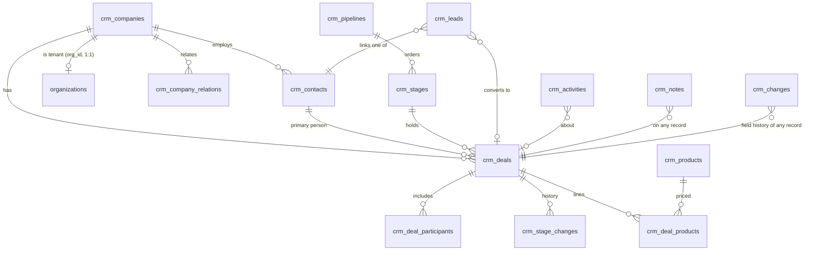

# 07 — Implementation plan matched to the code

Phase B output (A4) for `INSTRUCTIONS.md`, written 2026-10-03 after Tor's answers (`DECISIONS.md`
DEC-01…09). No application code is written in this phase. Phase 0 and Phase 1 are planned to work-package
level; Phases 2–8 at module level, to be re-planned at each gate from what the earlier phases teach (the
brief asks to measure the real pace in Phase 0 and re-size from it).

Conventions are the repository's, where they differ from the brief's proposals (A6: "follow the repository
and report the difference"):

| Brief says | Repository does | Plan follows |
| --- | --- | --- |
| RLS with explicit policies on every table | CRM tables have RLS on, **no policy and no grant**; every read and write goes through a `public.admin_crm_*` SECURITY DEFINER RPC that checks `app.crm_can_read/write()` and writes `app.admin_log` (`0055_crm.sql`) | The repository: RLS on, no policy, no client grant, RPC-only access. Stricter than the brief, and no client path can bypass the checks |
| `is_platform_admin(role)` | `app.is_platform_admin(app.platform_role[])`, on `app.admin_role()` which requires aal2 (`0049`) | Same functions; new gates built on them |
| pgTAP via `supabase test db` | Plain-SQL `supabase/tests/*_invariants.sql`, run by psql in CI | One `*_invariants.sql` suite per package |
| Regenerate types after every migration | No generated types; PostgREST rows are Zod-parsed (CLAUDE.md invariant 6) | Zod schemas in `lib/admin/*` updated with each RPC |
| shadcn/ui | `components/admin/ui.tsx` primitives, Tailwind tokens, no shadcn | Admin primitives |
| Storage for files | No storage bucket exists (CMS media are bytea) | One private Storage bucket, read only through signed URLs minted by an RPC that checks the record (WP-1.5) — new to the repo, flagged |

---

## 1. Data model mapping (Part F)

Every new table: schema `app`; RLS on, no policy, no grant to `anon`/`authenticated`; standard columns
`product_id text not null default 'orgpuls'`, `created_at/created_by`, `updated_at/updated_by`,
`deleted_at/deleted_by` (business records), `version int not null default 1` (business records); owner and
visibility where Part C gives the record an owner. Every foreign key has an explicit `on delete`, and every
FK and filter column an index. Immutability triggers follow CLAUDE.md's "permit referential maintenance" rule.
No table has a foreign key, view or function reference to the firewall list (`02-DATABASE.md` §10).

| Part F entity | Decision | Table | Key columns and rules |
| --- | --- | --- | --- |
| organization | Extend (DEC-03) | `app.crm_companies` | + address parts, country, lat/lng/geocoded_at, owner_id (exists), visibility, labels via `crm_label_links`, `custom jsonb`, deleted_at, version, created_by/updated_by; `org_id` made unique (1:1 with the product tenant) |
| contact | Extend | `app.crm_contacts` | + phones `jsonb`, owner_id, visibility, `custom jsonb`, deleted_at, version, created_by/updated_by; keeps `company_id` (a person belongs to at most one organization) |
| organization_relation | New | `app.crm_company_relations` | parent_id, child_id, kind parent/related; unique pair; check parent≠child |
| label | New | `app.crm_labels`, `app.crm_label_links` | set (deal, lead, contact, company), name, colour token; link (label_id, entity, record_id) |
| follower | New | `app.crm_followers` | admin user, entity, record_id; unique |
| pipeline | New | `app.crm_pipelines` | name, sort, visibility groups, card fields `jsonb`, archived_at |
| stage | Extend | `app.crm_stages` | + pipeline_id, probability 0–100, rot_days; existing keys stay as the default pipeline's stages |
| deal | New (DEC-02) | `app.crm_deals` | company_id, primary contact_id, title (only required field), value numeric, currency, pipeline_id, stage, owner_id, expected_close, probability, status open/won/lost, lost_reason_id/lost_text, source, archived_at, `custom jsonb`, visibility, std cols |
| deal_participant | New | `app.crm_deal_participants` | deal_id, contact_id; check ≠ primary |
| deal_stage_history | Extend | `app.crm_stage_changes` | + deal_id, pipeline_id, left_at (days in stage); company_id kept for the migrated history |
| lead | New (brief, Q7 default) | `app.crm_leads` | title, contact_id or company_id (check one), value, currency, owner, source, archived_at, converted_deal_id, `custom jsonb`, std cols |
| lost_reason | New | `app.crm_lost_reasons` | label, sort, archived_at |
| saved_filter | Extend + new | `app.crm_segments` stays for audiences; new `app.crm_filters` | entity, conditions `jsonb` (ALL/ANY groups), visibility private/shared, favourite per user |
| product, product_price, deal_product, revenue_schedule | New | `app.crm_products`, `crm_product_prices`, `crm_deal_products`, `crm_revenue_schedules` | deal value recalculated by trigger; MRR/ARR/ACV/TCV derived |
| currency, exchange_rate | New | `app.crm_currencies`, `app.crm_exchange_rates` | default NOK; rates dated |
| activity, activity_type, activity_guest | Extend + new | `app.crm_activities` + `crm_activity_types`, `crm_activity_guests` | activities gain type_id, starts_at, duration, owner_id, priority, deal_id/lead_id/project_id (check: one record), done_by; existing `kind` maps to types |
| note, comment, mention | New | `app.crm_notes`, `crm_comments`, `crm_mentions` | sanitized rich text (A7.4), pinned, entity + record_id |
| file | New | `app.crm_files` + private bucket | entity, record_id, storage path, mime, size; download via RPC-minted signed URL |
| changelog | New | `app.crm_changes` | entity, record_id, field, old, new, actor, source (user/automation/api/import/connector/meeting), at; append-only |
| event | Extend | `app.event_catalogue` + `app.growth_events` | CRM families registered (`deal.stage_changed`, …), written in the same transaction as the change; delivery bookkeeping in `app.crm_event_deliveries (event_id, subscriber)` for exactly-once (SF-02) |
| setting | New | `app.crm_setting_defs`, `app.crm_setting_values`, `app.crm_setting_log` | key, type, options, default, scope, applies_to; value history with who and when (A9) |
| custom_field | New | `app.crm_fields` | entity, key, type (16), group, options, required/important/from_stage, description, pipelines, read-only/hidden roles, formula; values in each record's `custom jsonb` with an expression index per filterable field |
| import_job, waitlist_item | New | `app.crm_imports`, `app.crm_import_rows`, `app.crm_waitlist` | rows tagged with import_id for revert; skip rows with reason |
| team, team_member, visibility_group, permission_set | New | `app.crm_teams`, `crm_team_members`, `crm_visibility_groups`, `crm_permission_sets`, `crm_staff_access` | staff only (platform admins), never customer users |
| notification | New | `app.crm_notifications` | admin user, kind, record, read_at; channel prefs per user |
| mail_* , booking, call_log, message, workflow*, sequence*, report*, goal, score*, feed_card, enrichment, credit_ledger, campaign extensions, board/project/task, chatbot/form, visitor, document/signature, meeting/transcript, api_token, oauth, webhook, entitlement, usage_counter, login_log, security_rule | New, in their phase | per Part F names with the `crm_` prefix | detailed at each phase's re-plan |

---

## 2. Decisions still needed (each with the default the plan uses until answered)

| # | Decision | Options and consequences | Default in this plan | Blocks |
| --- | --- | --- | --- | --- |
| P1 | Staff roles (open point 10, SEC-07) | (a) add `sales` and `project` to `app.platform_role`; (b) permission sets as rows assigned per staff user, roles kept as the coarse gate | **(b)**, with `marketing` mapped to a default "regular" set; super_admin = admin set | WP-0.4 onwards (every write checks a set) |
| P2 | Job runtime (open point 3) | pg_cron + edge functions (today) vs a separate worker | **pg_cron + edge functions** for Phases 0–1; decide before Phase 2 (mail sync) | Phase 2, 7 |
| P3 | Providers (open point 2) | one per service; each brings an API key in Vault (A7.8) and maybe a dependency (R9) | none chosen; geocoding (CRM-03) is the only Phase 1 need — default: OpenStreetMap Nominatim behind an adapter, rate-limited, no dependency | CRM-03, Phases 2–8 |
| P4 | Outbound webhook signing | signed (HMAC-SHA256 header, secret per subscription) or unsigned | **signed** — not a restriction, a receiver may ignore it | INT-04 (Phase 8) |
| P5 | Abuse protection on public endpoints (A7.9) | honeypot + per-IP rate limit as settings | honeypot on; rate limit setting default generous (e.g. 60/min per IP) — never blocks a person | LGN, booking, documents |
| P6 | Mobile and desktop clients (Q17) | React Native/Expo, PWA, or defer | **defer** to Phase 8 re-plan | MOB, MTG-03/07 |
| P7 | Editor role bug (Q2) | fix the whitelist | **fix in WP-0.4** (a bug, no behaviour anyone relies on) | — |
| P8 | Exclusion-based gates (Q3) | switch to allow-lists | **ask before changing** (it changes who sees what) | — |
| P9 | `product_id` on existing CRM tables (Q14) | add with default 'orgpuls' (additive, no rewrite) | **add** in WP-0.2 | — |
| P10 | Admin language (Q20) | per-user locale vs English plus format/time zone | **English plus per-user date/number/time zone** (CUS-05 partial until answered) | CUS-05 |

---

## 3. Work packages

### Phase 0 — Foundations (exit gate: a custom field works end to end on existing companies and contacts; SF-01, SF-02, SF-34, SF-38)

| WP | Closes | Migrations | Server and interface | Settings | Tests | Screens and states | Depends on |
| --- | --- | --- | --- | --- | --- | --- | --- |
| **WP-0.1 Settings registry** | CUS-07, SF-34, UF-29; DEC-04, DEC-07 | `crm_setting_defs/values/log`; seed all 15 register rows plus the caps found in code (campaign blocks, import rows, bulk ids, register rows, read caps) and the existing rule checks (consent source on new contact and import, typed reasons) — defaults unrestricted/off; `public.admin_crm_setting_set`, `admin_crm_settings_all`; `app.crm_rule(key)` for SQL callers | `lib/admin/crmSettings.ts` reader used by every action; existing caps and checks rewired to the registry (`LA/crmActions.ts`, `admin_crm_import`, `admin_crm_save_contact`, `admin_crm_stage_move`, `admin_crm_companies`); Settings → CRM section listing every setting, current value, default, who changed it and when; a refusal names its setting | all register rows | `crm_settings_registry_invariants.sql`: every row exists with its documented default, each default leaves the action unrestricted, each setting tested on and off, changes logged; vitest for the reader | Settings: populated, changed-from-default badge, permission denied (analyst read-only), long option lists, 390 | — |
| **WP-0.2 Record foundation** | SF-02 (write side), PIP-04 changelog, A6 standard columns | `crm_changes` (append-only), `crm_event_deliveries`; register CRM event families in `event_catalogue`; standard columns + `product_id` on existing CRM tables (additive); `app.crm_record_change()` used by every write RPC in one transaction with the audit row | changelog shown on company and contact pages | — | `crm_changelog_invariants.sql`: a field edit writes before/after/actor/source; change, changelog, audit and event commit together or not at all; stale `version` rejected | History list: empty, paginated, long values | WP-0.1 |
| **WP-0.3 Soft delete, restore, purge** | CRM-12, SF-15, PIP-17 (restore half) | `deleted_at/by` on CRM records; `admin_crm_restore`; pg_cron purge after 30 days (window is a setting) | Restore list (who, when, source); bulk delete preview | Second-admin approval (off) | `crm_restore_invariants.sql`: delete hides, restore returns links intact, purge removes after the window, approval setting on blocks until approved | Restore: empty, populated, preview, approval pending | WP-0.2 |
| **WP-0.4 Access: permission sets, teams, visibility; audit completeness** | SEC-07, SEC-08, SEC-09 (teams), SF-01; Q2, Q4 | `crm_permission_sets`, `crm_staff_access`, `crm_teams`, `crm_team_members`, `crm_visibility_groups`; `app.crm_can(action, entity)` and `app.crm_visible(owner, visibility)`; `admin_set_admin` accepts `editor`; `admin_log` added to the ~25 unaudited readers | Admin → Users & roles gains sets, teams, groups; every CRM RPC moves from `crm_can_write()` to `crm_can(action)` with the same defaults as today | Plan gates (counts) | `crm_access_invariants.sql`: allow/deny per role and set for select/insert/update/delete paths; visibility owner/group/sub-groups/everyone; anon and customer users denied; every reader writes an audit row; firewall test extended to follow calls through helpers (DEC-08) | Users & roles: sets, teams, denied | P1 |
| **WP-0.5 Custom fields** | CUS-01, CUS-02, CUS-03, CUS-04, SF-38; Phase 0 gate | `crm_fields`; `custom jsonb` on companies, contacts (later deals, leads, products, activities); expression indexes per filterable field; quality rules and formula evaluation in SQL; read-only/hidden enforced in the RPC that returns the record | Field admin screen; forms, filters and import read the registry | Count limits (options per field) | `crm_fields_invariants.sql`: a new field appears in reads, filters and import without a deploy; required blocks a manual save, is reported on import; hidden fields absent for a denied role; formula equals inputs; self-reference refused | Field admin: each of 16 types, long option lists, errors | WP-0.2, WP-0.4 |
| **WP-0.6 Event dispatcher** | SF-02 (delivery side), SF-26 runner | pg_cron job claiming undelivered events per subscriber with `crm_event_deliveries`; run records with failure alert in the job monitor | — | Technical safeguards (loop window) | `crm_events_invariants.sql`: each subscriber gets each event once; a failing subscriber retries without blocking others | — | WP-0.2 |
| **WP-0.7 Test harness for the admin** | A8 e2e and visual; Q19 | — | Playwright admin `@journey` specs signing in as the fixture's local admin; `scripts/verify/sentral-run.mjs` and the 390 check in CI; axe on admin pages | — | the harness itself, plus a smoke journey over the current CRM | baseline from `screens/baseline/` | — |
| **WP-0.8 Phase A clean-ups** | 06 §E | — | Partners «Revenue share» and the campaigns «Built in» rows read data or are omitted (never fabricate); hard-coded strings to messages; `demo` source in the enum and messages; overview "due" in Oslo time; scoring page role check | — | vitest for the moved strings; existing suites | affected CRM pages, 1440/390 | — |

### Phase 1 — Sales core (exit gate: UF-01, UF-02, UF-09, UF-10, UF-23, UF-24, UF-29; SF-07, SF-09, SF-10, SF-15, SF-25, SF-26, SF-32, SF-33, SF-35, SF-36, SF-37, SF-45)

| WP | Closes | Migrations | Server and interface | Tests | Depends on |
| --- | --- | --- | --- | --- | --- |
| **WP-1.1 Pipelines and deals (data move)** | PIP-02, PIP-03, SF-35; DEC-02 | `crm_pipelines`; stages gain pipeline_id, probability, rot_days; `crm_deals`; `crm_stage_changes.deal_id`; **data migration**: one deal per company that has a stage, value and owner today, history re-pointed; managed stages (trial/customer) become the company's subscription deal, still driven by the product plan; journeys' `stage_target` and win rate re-based on deal stages | every pipeline RPC moved to deals; compatibility kept for journeys until WP-3 | `crm_deals_invariants.sql`: counts before = after, win rate unchanged on the migrated history, a deal with title only is valid, stage delete moves deals to the chosen target; the five existing pipeline suites updated, not loosened | Phase 0 |
| **WP-1.2 Board, list, forecast** | PIP-01, PIP-05, PIP-06, PIP-07, PIP-10, PIP-11, PIP-13, PIP-14, PIP-15, PIP-16, PIP-17 | labels, lost reasons, archive, waitlist, card fields per pipeline, rotting check job | board paged per stage with activity-status icon, rotting flag, labels; list with columns, sort, inline and bulk edit, export; forecast by week/month/quarter; closed toggle remembered per user | rotting resets on each qualifying action; bulk edit writes one changelog row per deal; a bulk change is reverted from the changelog (CRM-12, DEC-27); forecast totals equal card sums; capacity setting on sends overflow to the waitlist, off by default | WP-1.1 |
| **WP-1.3 Deal detail** | PIP-04, PIP-08, PIP-09 | participants, followers | header, followers, won/lost, progress bar with days, sidebar sections reorderable, Focus, History filter incl. changelog | follower notified on stage change; participant ≠ primary | WP-1.1, WP-0.2 |
| **WP-1.4 Activities** | ACT-01…07, SF-36, SF-07 | activity types, time/duration/owner/priority, links to deal/lead/company/contact, `crm_notifications`, reminder job | calendar day/week/month with drag, to-do list, bulk create, next-step prompt (per-user switch), in-app + email reminders | one reminder per channel; completion stamps and emits; bulk creates one per record; deal without open activity shows the warning | WP-1.1 |
| **WP-1.5 Records** | CRM-01, CRM-02, CRM-03, CRM-05, CRM-06, CRM-10, CRM-13, CRM-14, CRM-15, SF-33, SF-37 | company and contact extensions, relations, notes/comments/mentions, files + private bucket, geocode cache, source enum widened | detail views with deals/activities/files/notes; timeline view; map (P3); exports CSV/XLSX (`lib/xlsx.ts`) formula-safe and logged | a user who cannot see the record cannot fetch its file; mention of a hidden record sends no content; export rows equal visible rows; parent lists daughters | WP-0.2…0.5 |
| **WP-1.6 Import and merge** | CRM-09, CRM-11, SF-09, SF-10, UF-10 | `crm_imports/import_rows`, match rules, merge RPC | all-entity import with mapping, duplicate preview, skip file, history and revert; duplicate list and compare/merge | every row created, merged or skipped with a reason; revert by import id; merge keeps combined history | WP-1.5 |
| **WP-1.7 Leads** | LEA-01, LEA-02, LEA-03, LEA-04, SF-45 (LEA-05/06 in Phase 2) | `crm_leads`, lead labels; inbound paths (contact form, demo, newsletter) create leads with source | leads inbox with archive toggle; convert lead↔deal moving notes, activities, files | a lead never appears in a pipeline before conversion; conversion carries history | WP-1.1, WP-1.5 |
| **WP-1.8 Search and filters** | PIP-12, SF-25 | `crm_filters`; trigram/tsvector index over CRM tables only | global search grouped by type; ALL/ANY filter builder; saved, shared, favourite | a saved filter returns the same set in pipeline, list and forecast; survey tables never indexed | WP-1.1, WP-0.5 |
| **WP-1.9 Customization remainder** | CUS-05, CUS-06, CUS-08 | currencies and rates; per-user format and time zone; sample records marked and removable | currency on deals and products; sample data in the demo tenant | report in default currency converts every value; sample removal leaves live data | WP-1.1 |

### Phases 2–8 — module level (re-planned at each gate)

| Phase | Modules | Main new tables | Blocking decisions | Gate flows (Part G) |
| --- | --- | --- | --- | --- |
| 2 Engagement | COM, ACT-08/09, CRM-04, LEA-05/06 | mail_account/thread/message/link/event, booking, call_log, message thread | P2 job runtime, P3 providers (mail, calendar, telephony, messaging, video), open point 6 (LinkedIn) | UF-04, UF-06, UF-25 |
| 3 Automation | AUT-01…12, CMP-07 | workflow(+version), runs, step runs, assignment rules/log, sequence/enrollment as records | open point 1 (extend the dispatcher + claim loop) | UF-05, UF-11, UF-12 |
| 4 Insight | INS, PRO, CRM-07/08 | report, dashboard, goal, public link, rollups, score models, feed cards, products, revenue schedules, enrichment, credit ledger | P3 (enrichment), DEC-05 (Stripe for Orgpuls figures), DEC-08 | UF-03, UF-13, UF-14, UF-26 |
| 5 Capture and close | LGN, WEB, DOC | chatbot, chat, web forms, submissions, tracked site, visitor company, visit, documents, signatures | P3 (IP-to-company, e-signature, drives), open point 5, P5 | UF-08, UF-18, UF-19 |
| 6 Market and deliver | CMP (extensions), PRJ | campaign builder rows, boards/phases/projects/tasks/dependencies/templates | — | UF-17, UF-20 |
| 7 AI | AIA, MTG, INS-09, PRJ-06/07 AI parts | AI call log, meetings, recordings, transcripts, briefs, suggestions | P3 (model, transcription), open points 5 and 8 (cost) | UF-07, UF-27 |
| 8 Platform and channels | INT, MCP, SEC-01…06/10/11, MOB, ENT | api tokens, oauth, webhooks + deliveries, entitlements, usage counters, login log, security rules | P4, P6, DEC-05 (ENT-03 on Stripe) | UF-15, UF-16, UF-21, UF-22, UF-28 |

## 4. Order

Phase 0 in the order 0.1 → 0.2 → (0.3, 0.4, 0.6 in parallel) → 0.5; 0.7 and 0.8 alongside. Phase 1 starts
with 1.1 (the data move), then 1.2–1.9. SEC-07/08/09 move from Phase 8 into Phase 0 because Phase 1's
acceptance criteria name permissions and visibility. Everything else follows Part G.

## 5. Test plan (every package)

- **Database:** one `*_invariants.sql` per package in the repository's style, covering structure, RLS
  (enabled, no policy, no grant; anon and customer users denied on every new table), allow/deny per staff role
  and permission set through the RPCs, visibility, triggers, settings in both states, soft delete/restore/purge,
  stale version, each data acceptance criterion; plus `definer_grants_invariants.sql` and the growth firewall
  suite re-run after every migration (A7.16).
- **Unit:** vitest for pure logic (filters, settings evaluation, rotting, forecast totals, merge fields,
  formulas, derived revenue).
- **End-to-end:** Playwright admin journeys per gate flow (WP-0.7).
- **Visual:** every new screen and state at 1440 and 390 into `screens/phase-<n>/`, inspected, added to the
  admin pixel gate; axe and a keyboard pass.
- **Gates per push:** `npx tsc --noEmit`, `npm run lint`, `npm run verify:i18n`, `npx next build`, vitest, all
  SQL suites, `supabase db lint`, `node scripts/audit/wiring.mjs`, `npm audit --omit=dev`.

## 6. What happens next

On Tor's approval of this plan, Phase C starts with WP-0.1 (settings registry), one package at a time, each
committed, gated and applied on hosted (DEC-09), with `05-GAP-FEATURES.md` updated per ID. Phase 0 ends with
its gate flows and a phase report (`reports/phase-0.md`).
